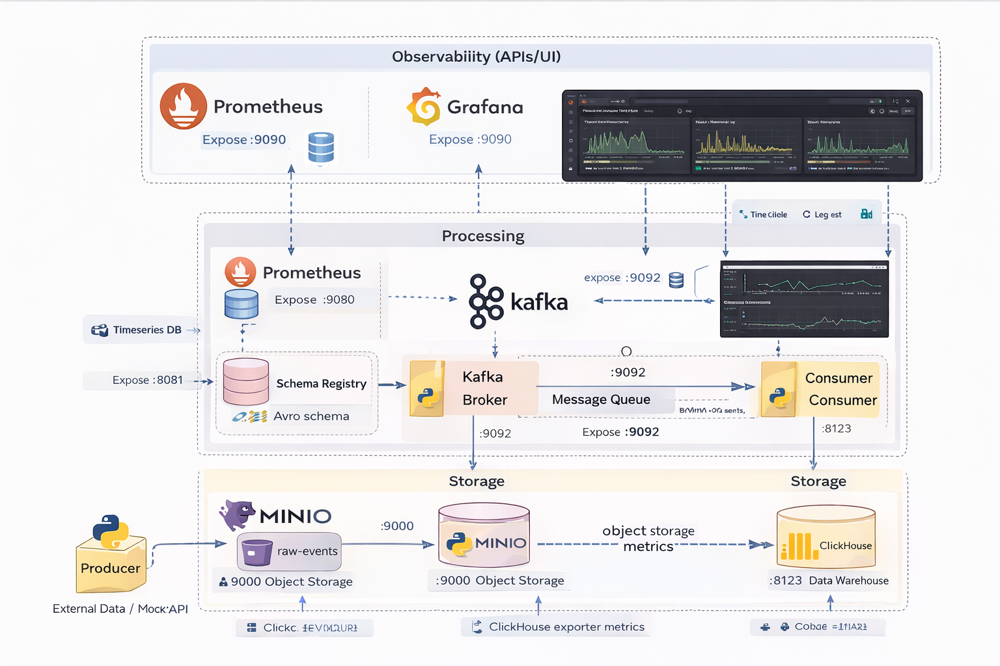

# Near Real-Time Data Pipeline Lab

This project is a **near real-time data pipeline** built to demonstrate a modern, production-style streaming architecture using Kafka, Schema Registry, MinIO, ClickHouse, and a full observability stack (Prometheus + Grafana).

The pipeline ingests events from an external API, validates them using Avro schemas, streams them through Kafka, persists raw data in object storage, loads analytical data into ClickHouse, and exposes operational metrics for monitoring.

---

## 🏗 Architecture Overview

**Layers and responsibilities:**



### 1. Ingestion Layer
- **Mock API**  
  Generates synthetic event data (`/event` endpoint).
- **Producer (Python)**  
  - Polls Mock API
  - Serializes events using **Avro**
  - Registers schemas in **Schema Registry**
  - Publishes messages to Kafka topic `events.v1`

### 2. Streaming Layer
- **Apache Kafka**
  - Topic-based message streaming
  - Supports consumer groups
- **Schema Registry**
  - Centralized Avro schema management
  - Compatibility mode: `BACKWARD`

### 3. Processing Layer
- **Consumer (Python)**
  - Reads Avro messages from Kafka
  - Deserializes using Schema Registry
  - Buffers events (time-based flush)
  - Writes:
    - Raw JSONL files to MinIO
    - Structured rows to ClickHouse

### 4. Storage Layer
- **MinIO (S3-compatible)**
  - Raw events stored as partitioned JSONL
  - Path pattern:
    ```
    dt=YYYY-MM-DD/hour=HH/events_YYYYMMDD_HHMMSS.jsonl
    ```
- **ClickHouse**
  - Analytical storage
  - Table: `analytics.events_raw`
  - Optimized for fast aggregations

### 5. Observability Layer
- **Prometheus**
  - Scrapes metrics from:
    - Kafka Exporter
    - ClickHouse Exporter
    - MinIO
- **Grafana**
  - Dashboards for:
    - Kafka throughput
    - Consumer lag
    - System health

---

## 🧩 Main Components

| Component | Purpose |
|---------|--------|
| Kafka | Message streaming backbone |
| Schema Registry | Avro schema versioning & compatibility |
| Producer | Event ingestion & serialization |
| Consumer | Stream processing & persistence |
| MinIO | Raw object storage |
| ClickHouse | Analytical database |
| Prometheus | Metrics collection |
| Grafana | Visualization & monitoring |

---

## 🌐 Service Endpoints

| Service | URL | Notes |
|------|----|------|
| Kafka UI | http://localhost:18082 | Topics, consumers, schemas |
| Schema Registry | http://localhost:18081/subjects | Avro subjects |
| MinIO Console | http://localhost:19001 | Credentials from `.env` |
| ClickHouse HTTP | http://localhost:18123 | SQL over HTTP |
| Prometheus | http://localhost:19090 | Metrics & targets |
| Grafana | http://localhost:13000 | `admin / admin` |
| Mock API | http://localhost:8000/event | Event generator |

---

## 🚀 Running the Stack

Start all services:

```bash
docker compose up -d --build
```

## Validation & Health Checks
List topics:
```bash
docker compose exec kafka bash -lc \
"/opt/bitnami/kafka/bin/kafka-topics.sh --bootstrap-server kafka:9092 --list"

```

List subjects:
```bash
curl http://localhost:18081/subjects

```


Check schema versions:
```bash
curl http://localhost:18081/subjects/events.v1-value/versions

```


Check schema versions:
```bash
curl http://localhost:18081/subjects/events.v1-value/versions

```
Global compatibility:
```bash
curl http://localhost:18081/config

```


Producer
```bash
docker logs -n 80 near-realtime-lab-producer-1

```

Test API manually:
```bash
curl http://localhost:8000/event

```


## Consumer

Check logs:
```bash
docker logs -n 200 near-realtime-lab-consumer-1

```

## MinIO

Buckets created automatically via minio-init

Raw events written as JSONL

Metrics exposed to Prometheus

## ClickHouse
```bash
docker exec -it near-realtime-lab-clickhouse-1 clickhouse-client -q \
"SHOW TABLES FROM analytics"


docker exec -it near-realtime-lab-clickhouse-1 clickhouse-client -q \
"DESCRIBE TABLE analytics.events_raw"

docker exec -it near-realtime-lab-clickhouse-1 clickhouse-client -q \
"SELECT count() FROM analytics.events_raw"


docker exec -it near-realtime-lab-clickhouse-1 clickhouse-client -q \
"SELECT event_id, type, currency, amount, ingested_at
 FROM analytics.events_raw
 ORDER BY ingested_at DESC
 LIMIT 5"


```

## Observability

Prometheus

UI: http://localhost:19090

Targets: http://localhost:19090/targets

Check logs:
```bash
docker compose logs -n 80 prometheus
```

## Grafana
UI: http://localhost:13000

Credentials: admin / admin

Dashboards auto-provisioned

Check logs:
```bash
docker compose logs -n 80 grafana
```

## 🧪 Key Design Decisions

Avro + Schema Registry
Strong schema governance and safe evolution.

Backward compatibility
Ensures old consumers continue working with new schemas.

Dual storage pattern

MinIO → raw immutable data (data lake style)

ClickHouse → analytics & dashboards

Time-based flushing

Reduces pressure on ClickHouse

Improves batching efficiency

Full observability

Kafka lag

Throughput


Storage health
